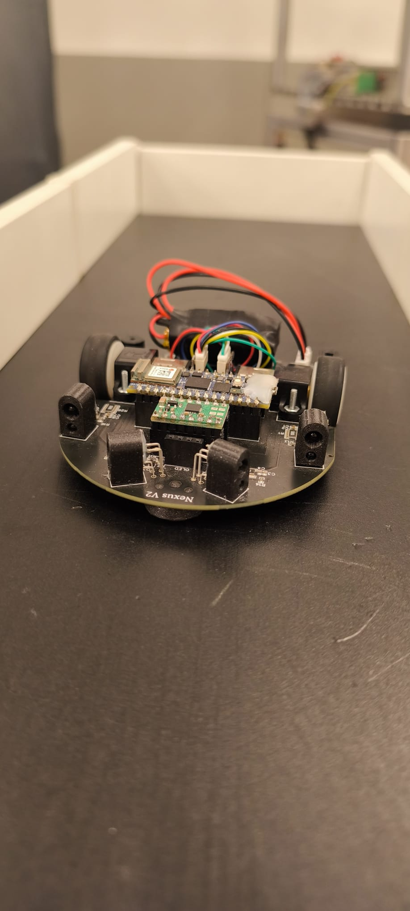
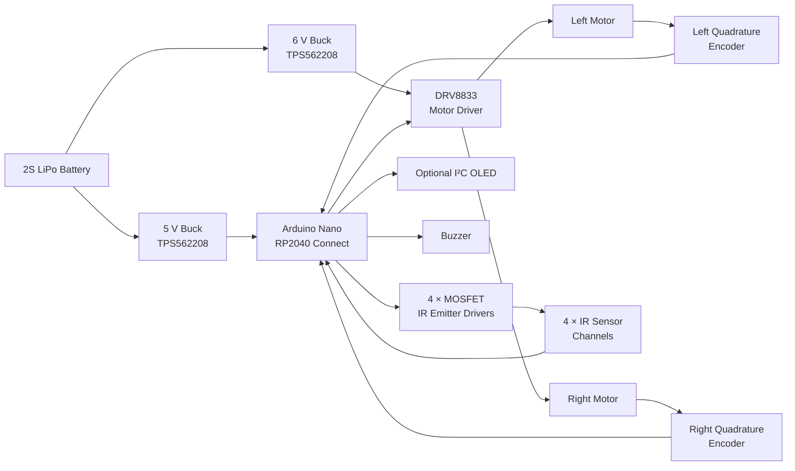
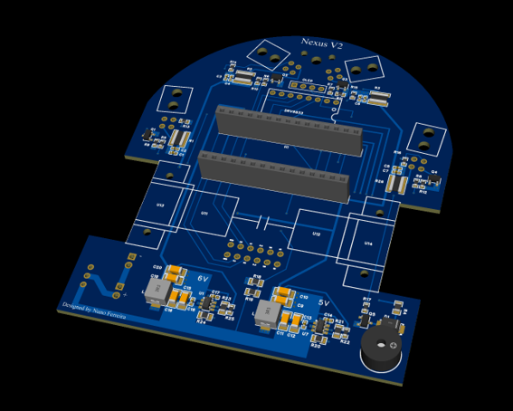
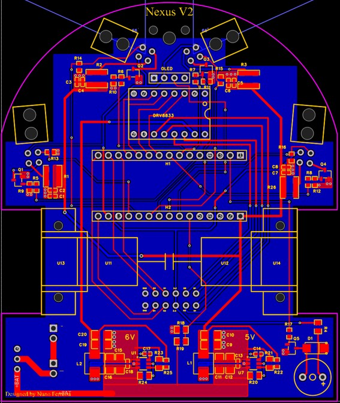
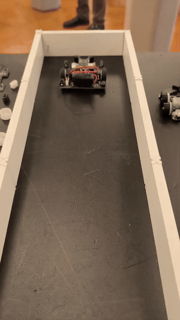

# Nexus V2 — Autonomous Micromouse Robot

**Nexus V2** is a personal robotics project developed from **2023 to 2024** for the **Micromouse Portuguese Contest**. The robot uses a custom 2-layer PCB as its structural chassis and integrates power conversion, motor control, quadrature encoder feedback, infrared wall sensing, and an Arduino Nano RP2040 Connect.

The project covers the complete development cycle: electronic architecture, schematic capture, PCB layout, mechanical design, embedded firmware, control algorithms, system integration, and testing.

<p align="center">
  
</p>

> **Project status:** Functional prototype. Closed-loop wheel-speed control, encoder-based odometry, 90°/180° turns, infrared wall detection, and autonomous wall-aware track navigation have been implemented. A complete maze-solving algorithm such as flood-fill is not yet implemented.

## Highlights

| Area | Implementation |
|---|---|
| Main controller | Arduino Nano RP2040 Connect |
| PCB | Custom 2-layer, 1.6 mm PCB; approximately 84 × 100 mm maximum envelope |
| PCB CAD | EasyEDA |
| Motor driver | Pololu DRV8833 dual motor driver carrier |
| Motors | 2 × Pololu 30:1 Micro Metal Gearmotor HPCB 6 V |
| Feedback | 2 × 12 CPR magnetic quadrature encoders |
| Wall sensing | 4 × custom IR channels using SFH4545 emitters and TEFT4300 phototransistors |
| Power | 2S LiPo; independent 6 V motor rail and 5 V logic rail using TPS562208 buck converters |
| Firmware | C++ using the Arduino framework |
| Control | Independent wheel PID speed control, differential-drive odometry and encoder-based turning |
| Mechanical CAD | Fusion 360 |
| Manufacturing | PCB manufactured and assembled by JLCPCB |

## What I Designed

This was an individual project. I was responsible for:

- System and electronic architecture
- Schematic design and component selection
- PCB layout and board outline
- Power architecture and motor-control integration
- Infrared sensing circuitry
- Embedded C++ firmware
- Quadrature encoder processing
- Wheel-speed PID control
- Odometry and motion control
- Autonomous wall-aware navigation logic
- Mechanical integration
- Custom wheel, sensor mount and slide-pad design
- Bring-up, calibration and system testing

## System Architecture



## PCB and Mechanical Design

The PCB is not only an electronics carrier: it is also the **main structural chassis of the robot**. Its irregular outline was designed around the motor positions, sensor geometry and competition size constraints while giving the robot a compact car-like appearance.

The Arduino Nano RP2040 Connect and the DRV8833 carrier are socketed, allowing them to be removed during development or replacement. The board also integrates the motor/encoder connections, sensing electronics, power conversion, battery interface, buzzer and an I²C expansion connection for an OLED display.

<p align="center">
  
</p>

<p align="center">
  
</p>

The mechanical integration was designed in **Fusion 360**. The PCB itself forms the chassis, while several custom parts were created specifically for the robot:

- **20 mm wheel** designed to fit a separately sourced tyre
- **Sensor mount** for positioning the infrared sensing hardware
- **Low-friction slide pad** used as the front support instead of a third wheel

The two DC gearmotors are secured using **Pololu motor mounts**.

STEP files for the custom-designed mechanical parts are included in this repository.

## Infrared Wall Sensing

Nexus V2 uses four discrete reflective infrared sensor channels built from **SFH4545 IR emitters** and **TEFT4300 phototransistors**.

The sensor placement was chosen to provide complementary wall information:

- Two forward-mounted sensors are angled outward to measure the left and right side walls.
- Two sensors positioned further back face mostly forward, with a small angle that also helps detect corners in the cell ahead.

Each IR emitter is independently switched through a MOSFET. Rather than leaving the emitters permanently on, the firmware measures each channel in two stages:

1. Read the receiver with the IR emitter **off** to measure ambient light.
2. Turn the emitter **on**, wait briefly for settling and average multiple ADC samples.
3. Subtract the ambient reading from the illuminated reading.

This reduces sensitivity to ambient light. The four channels are sampled sequentially to reduce optical cross-talk between nearby emitters. Experimental calibration curves are then used to convert the differential ADC values into approximate distances.

## Encoder Processing and Odometry

Each motor uses a dual-channel magnetic quadrature encoder. Both encoder channels are processed using edge-triggered interrupts, allowing the firmware to determine both displacement and direction of rotation.

Encoder measurements are used to estimate individual wheel speed in **mm/s** and to calculate differential-drive odometry. The robot therefore estimates linear displacement and heading entirely from wheel feedback, without an IMU or gyroscope.

This encoder-based approach is also used to calibrate repeatable linear movements and in-place turns such as **90° and 180° rotations**.

## Closed-Loop Motion Control

Each wheel has an independent PID speed controller. Motion commands generate left and right wheel-speed setpoints in mm/s, and the controller continuously compensates for differences between the two motors.

For straight-line motion, both wheels receive the same nominal speed target while encoder feedback corrects speed mismatch. For in-place rotations, the two wheels are commanded in opposite directions and the turn is terminated using encoder-derived motion.

The firmware also uses side-wall measurements to modify the relative wheel speeds during wall following, helping keep the robot centred and preventing contact with the maze walls.

## Power Architecture

The robot is powered by two 300 mAh LiPo cells connected in series as a **2S battery pack**. Two independent TPS562208 buck converters generate:

- **6 V** for the DC motors
- **5 V** for the controller and sensors

The board also includes a main power switch and battery-voltage monitoring through an analog divider.

## Demonstrated Behaviour

The current prototype has been demonstrated autonomously on a test track. In the recorded demonstration, the robot:

1. Drives in a straight line under closed-loop speed control.
2. Uses the IR sensors together with encoder distance information to detect the end of the track.
3. Performs an in-place 180° turn.
4. Returns along the track.
5. Repeats the sequence autonomously.

The project has also reached autonomous wall-aware navigation without collisions. Full Micromouse maze mapping and flood-fill path planning remain future work.

## Demo

The Nexus V2 autonomously drives along the test track, detects the end of the path, performs an in-place 180° rotation, and returns along the track.

<p align="center">
  <a href="media/nexus-v2-demo.mp4">
    
  </a>
</p>

<p align="center">
  <em>Click the animation to view the original video.</em>
</p>

## Design Files

- [Schematic PDF](docs/nexus-v2-schematic.pdf)
- EasyEDA schematic and PCB source files — to be added
- Mechanical STEP files:
  - [Wheel](mechanical/step/wheel.step)
  - [Sensor mount](mechanical/step/sensor-mount.step)
  - [Slide pad](mechanical/step/slide-pad.step)

> The firmware is currently being refined and is intentionally not included in the public portfolio version yet.

## Repository Structure

```text
nexus-v2-micromouse/
├── README.md
├── images/
│   ├── nexus-v2-prototype.jpg
│   ├── pcb-3d-render.png
│   └── pcb-layout.jpg
├── docs/
│   └── nexus-v2-schematic.pdf
├── mechanical/
│   └── step/
│       ├── wheel.step
│       ├── sensor-mount.step
│       └── slide-pad.step
└── media/
    ├── nexus-v2-demo.mp4
    └── nexus-v2-demo.gif
```

## Tools and Technologies

`EasyEDA` · `Fusion 360` · `Arduino C++` · `RP2040` · `PID Control` · `Quadrature Encoders` · `IR Sensing` · `Differential-Drive Odometry` · `JLCPCB`

---

**Designed and developed by Nuno**
